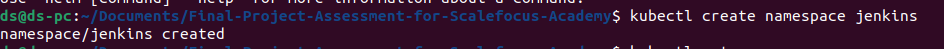
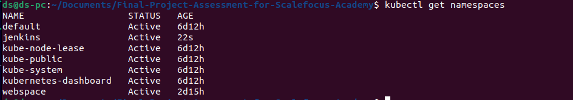
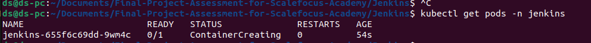
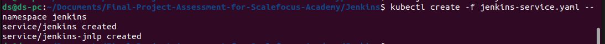
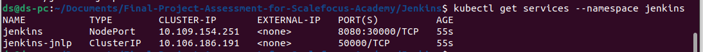

# Final-Project-Assessment-for-Scalefocus-Academy

Deploy a WordPress on Kubernetes (using Minicube) with Helm and
automation with Jenkins.

Prerequisites:
1. Install the necessary tools: Minicube, Helm and Jenkins.
2. Separate repo in your GitHub Profile named: Final Project Assessment for Scalefocus Academy
Requirement for the Project Assessment:
1. Download Helm chart for WordPress. ( Bitnami chart:
https://github.com/bitnami/charts/tree/main/bitnami/wordpress )
2. In values.yaml, you need to change line 543 from type: LoadBalancer to type: ClusterIP ( Hint: there
will be one more problem when deploying. Resolve it. )
3. Create a Jenkins pipeline that checks if wp namespace exists, if it doesn’t then it creates one.
Checks if WordPress exists, if it doesn’t then it installs the chart.
4. Name the Helm Deployment as: final-project-wp-scalefocus.
5. Deploy the helm chart using the Jenkins pipeline.
6. Load the home page of the WordPress to see the final result.
7. Explain the project directly in a README.md file in your project repo.

# Installing nesesery tools ??
- minikube
- helm chart 
- docker
- jeniks

Start the minikube with following command 

    minikube start

Now we are going to deploy Jenkins in our kubernetes cluster, you can use the defualt namespace or you can create new one, im going to use the **default** namespace. First we create new directory jenikis, and create to new files named **jenkins-deployment.yaml** and **jenkins-service.yaml**

Create new namespace **jenkins** 

    kubectl create namespace jenkins

verify

In the file jenkins-deployment.yaml add:

    apiVersion: apps/v1
    kind: Deployment
    metadata:
    name: jenkins
    spec:
    replicas: 1
    selector:
        matchLabels:
        app: jenkins
    template:
        metadata:
        labels:
            app: jenkins
        spec:
        containers:
        - name: jenkins
            image: jenkins/jenkins:lts
            ports:
            - name: http-port
                containerPort: 8080
            - name: jnlp-port
                containerPort: 50000
            volumeMounts:
            - name: jenkins-vol
                mountPath: /var/jenkins_vol
        volumes:
            - name: jenkins-vol
            emptyDir: {}

Now create this deployment in the jenkins namespace:

    kubectl create -f jenkins-deployment.yml --namespace jenkins

Use kubectl to verify the pod’s state:

    kubectl get pods -n jenkins

    

Create and open a new file called jenkins-service.yaml:

    apiVersion: v1
        kind: Service
        metadata:
        name: jenkins
        spec:
        type: NodePort
        ports:
            - port: 8080
            targetPort: 8080
            nodePort: 30000
        selector:
            app: jenkins

    ---

    apiVersion: v1
        kind: Service
        metadata:
        name: jenkins-jnlp
        spec:
        type: ClusterIP
        ports:
            - port: 50000
            targetPort: 50000
        selector:
            app: jenkins

Now create the Service in the same namespace:

    kubectl create -f jenkins-service.yaml --namespace jenkins

Check that the Service is running:

