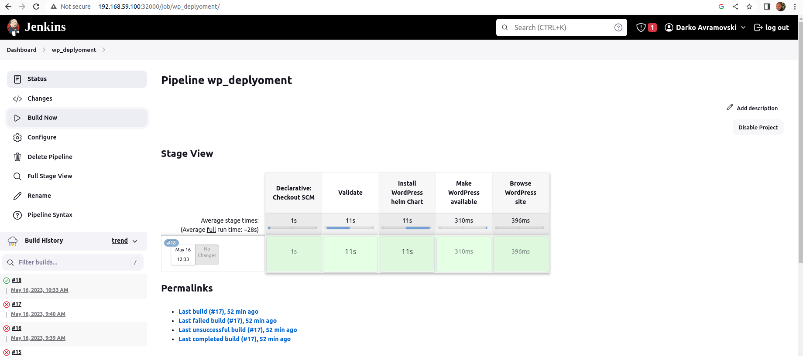
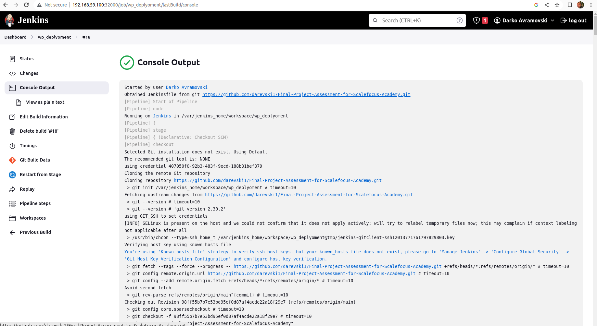
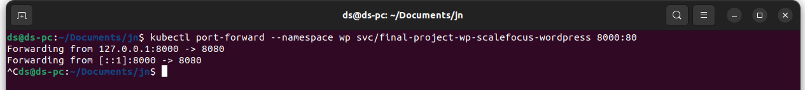
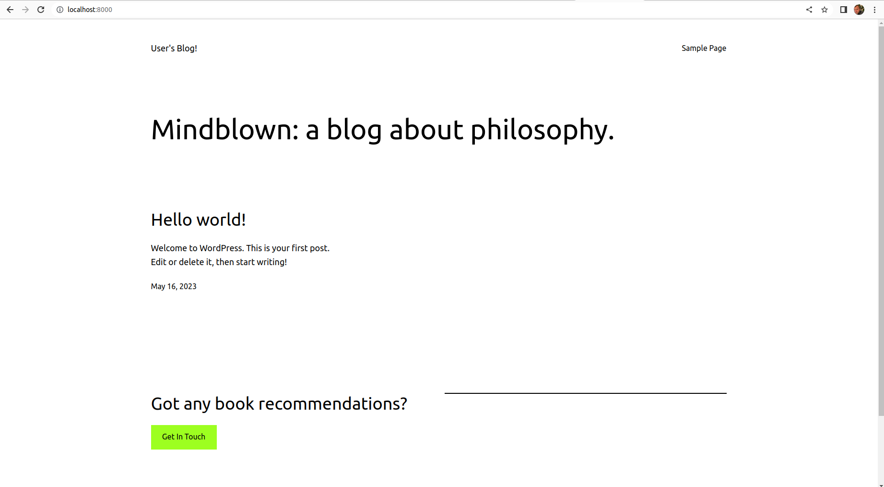
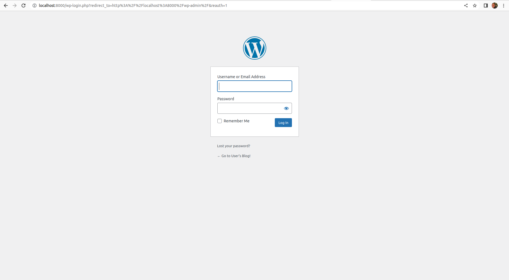

# Final-Project-Assessment-for-Scalefocus-Academy

Deploy a WordPress on Kubernetes (using Minicube) with Helm and
automation with Jenkins.

Prerequisites:
1. Install the necessary tools: Minicube, Helm and Jenkins.
2. Separate repo in your GitHub Profile named: Final Project Assessment for Scalefocus Academy
Requirement for the Project Assessment:
1. Download Helm chart for WordPress. ( Bitnami chart:
https://github.com/bitnami/charts/tree/main/bitnami/wordpress )
2. In values.yaml, you need to change line 543 from type: LoadBalancer to type: ClusterIP ( Hint: there
will be one more problem when deploying. Resolve it. )
3. Create a Jenkins pipeline that checks if wp namespace exists, if it doesn’t then it creates one.
Checks if WordPress exists, if it doesn’t then it installs the chart.
4. Name the Helm Deployment as: final-project-wp-scalefocus.
5. Deploy the helm chart using the Jenkins pipeline.
6. Load the home page of the WordPress to see the final result.
7. Explain the project directly in a README.md file in your project repo.

### **For this Assessment we need to install Helm, Minkube and Jenkins**.

- **Install Helm** - Official documentation [Jenkins](https://helm.sh/docs/intro/install/)

- **Install Minikube** - Official documentation [Minikube](https://minikube.sigs.k8s.io/docs/start/)

- For setting up a ***Jenkins Cluster on Kubernetes***, we will do the following:
we need to create four files **serviceAccount.yaml**,  **volume.yaml**, **deployment.yaml**,  **service.yaml'**. and save then in **jeniks** directory and execute them so jenkins can be installed on minikube cluster. Official documentation [Jenkins](https://www.jenkins.io/doc/book/installing/kubernetes/)

We can pull localy the offical wordpress image from github **bitnami/wordpress/** reposity, and edit ***values.yaml*** on line 534 replace **type: LoadBalancer** to **type: ClusterIP,** after we edit the offical image we can create our repository on GitHub which we are going to use for deployment for the wordpress site, and push to our repository **darevski1/Final-Project-Assessment-for-Scalefocus-Academy**.

After we setup jenkins on minikube we can log using following ip ***http://192.168.59.100:32000/***  to login and install required plugin **kuberentes  - Kubernetes plugin for Jenkins** the plugin is required
 so we can create connection to our minikube local cluster. Next we need to create new pipeline and connect to our **github** respository. Create **Jenkinsfile** we put our script for deplyoment, the deplyoment proces has four stages:

- ***Validate*** - stages check is the namespace **wp** exist, if not exist the namespace will be created
- ***Install*** - wordpress and helm chard, here we install helm binary, and install wordpress helm chart
- ***Make wordpress availble*** - in the stage we are running port forwarding, so the site can be acceess localy.
- ***Browse WordPress site stage*** - !!! The site can`t be accees from outside because we put ClusterIP in values.yaml, **Cluster ip** default type for service in kubernetes, this type of address can be used only inside the cluster.

#### We can run the pipeline we created and get following results

        Started by user Darko Avramovski
        Obtained Jenkinsfile from git https://github.com/darevski1/Final-Project-Assessment-for-Scalefocus-Academy.git
        [Pipeline] Start of Pipeline
        [Pipeline] node
        Running on Jenkins in /var/jenkins_home/workspace/wp_deplyoment
        [Pipeline] {
        [Pipeline] stage
        [Pipeline] { (Declarative: Checkout SCM)
        [Pipeline] checkout
        Selected Git installation does not exist. Using Default
        The recommended git tool is: NONE
        using credential 407050f0-92b3-483f-9ecd-188b31bef379
        > git rev-parse --resolve-git-dir /var/jenkins_home/workspace/wp_deplyoment/.git # timeout=10
        Fetching changes from the remote Git repository
        > git config remote.origin.url https://github.com/darevski1/Final-Project-Assessment-for-Scalefocus-Academy.git # timeout=10
        Fetching upstream changes from https://github.com/darevski1/Final-Project-Assessment-for-Scalefocus-Academy.git
        > git --version # timeout=10
        > git --version # 'git version 2.30.2'
        using GIT_SSH to set credentials 
        [INFO] SELinux is present on the host and we could not confirm that it does not apply actively: will try to relabel temporary files now; this may complain if context labeling not applicable after all
        > /usr/bin/chcon --type=ssh_home_t /var/jenkins_home/workspace/wp_deplyoment@tmp/jenkins-gitclient-ssh10553168664119525960.key
        Verifying host key using known hosts file
        You're using 'Known hosts file' strategy to verify ssh host keys, but your known_hosts file does not exist, please go to 'Manage Jenkins' -> 'Configure Global Security' -> 'Git Host Key Verification Configuration' and configure host key verification.
        > git fetch --tags --force --progress -- https://github.com/darevski1/Final-Project-Assessment-for-Scalefocus-Academy.git +refs/heads/*:refs/remotes/origin/* # timeout=10
        > git rev-parse refs/remotes/origin/main^{commit} # timeout=10
        Checking out Revision 63537e1b18e43701363da80a5a1f02a7f929794d (refs/remotes/origin/main)
        > git config core.sparsecheckout # timeout=10
        > git checkout -f 63537e1b18e43701363da80a5a1f02a7f929794d # timeout=10
        Commit message: "Final-Project-Assessment-for-Scalefocus-Academy"
        > git rev-list --no-walk 6759a289e693ab6dd7848391e6a0582a2515f7fb # timeout=10
        [Pipeline] }
        [Pipeline] // stage
        [Pipeline] withEnv
        [Pipeline] {
        [Pipeline] stage
        [Pipeline] { (Validate)
        [Pipeline] sh
        + echo Download required binaries
        Download required binaries
        + curl -L -s https://dl.k8s.io/release/stable.txt
        + curl -LOs https://dl.k8s.io/release/v1.27.1/bin/linux/amd64/kubectl
        + chmod +x kubectl
        + curl -Os https://github.com/stedolan/jq/releases/download/jq-1.6/jq-linux64
        + mv jq-linux64 jq
        + chmod +x jq
        [Pipeline] script
        [Pipeline] {
        [Pipeline] sh
        + ./kubectl get ns wp -o jsonpath={.status.phase}
        [Pipeline] echo
        Active
        [Pipeline] echo
        wp namespace already created
        [Pipeline] }
        [Pipeline] // script
        [Pipeline] }
        [Pipeline] // stage
        [Pipeline] stage
        [Pipeline] { (Install WordPress helm Chart)
        [Pipeline] sh
        + curl -Os https://get.helm.sh/helm-v3.12.0-linux-amd64.tar.gz
        + tar zxvf helm-v3.12.0-linux-amd64.tar.gz
        linux-amd64/
        linux-amd64/helm
        linux-amd64/README.md
        linux-amd64/LICENSE
        [Pipeline] sh
        + ./linux-amd64/helm dependency build ./helm/wordpress/
        Saving 3 charts
        Downloading memcached from repo oci://registry-1.docker.io/bitnamicharts
        Pulled: registry-1.docker.io/bitnamicharts/memcached:6.4.2
        Digest: sha256:ac800af4f9b6be921043eb5cd2ba07828ad6fc404b5762f2630657d9fdf5a6fe
        Downloading mariadb from repo oci://registry-1.docker.io/bitnamicharts
        Pulled: registry-1.docker.io/bitnamicharts/mariadb:12.2.2
        Digest: sha256:f18fd0e930041ef6a1dff0789eb801f2c4c52f1e8e0ff7c610b109ae8304d74c
        Downloading common from repo oci://registry-1.docker.io/bitnamicharts
        Pulled: registry-1.docker.io/bitnamicharts/common:2.2.5
        Digest: sha256:a088a039a53958fdd4ddff5a9799c0dba38d1c480bc768a9141cb87e7fcf7036
        Deleting outdated charts
        + ./linux-amd64/helm upgrade -i -f ./helm/wordpress/values.yaml final-project-wp-scalefocus ./helm/wordpress -n wp
        Release "final-project-wp-scalefocus" has been upgraded. Happy Helming!
        NAME: final-project-wp-scalefocus
        LAST DEPLOYED: Tue May 16 13:24:09 2023
        NAMESPACE: wp
        STATUS: deployed
        REVISION: 14
        TEST SUITE: None
        NOTES:
        CHART NAME: wordpress
        CHART VERSION: 16.1.2
        APP VERSION: 6.2.0

        ** Please be patient while the chart is being deployed **

        Your WordPress site can be accessed through the following DNS name from within your cluster:

        final-project-wp-scalefocus-wordpress.wp.svc.cluster.local (port 80)

        To access your WordPress site from outside the cluster follow the steps below:

        1. Get the WordPress URL by running these commands:

        kubectl port-forward --namespace wp svc/final-project-wp-scalefocus-wordpress 80:80 &
        echo "WordPress URL: http://127.0.0.1//"
        echo "WordPress Admin URL: http://127.0.0.1//admin"

        2. Open a browser and access WordPress using the obtained URL.

        3. Login with the following credentials below to see your blog:

        echo Username: user
        echo Password: $(kubectl get secret --namespace wp final-project-wp-scalefocus-wordpress -o jsonpath="{.data.wordpress-password}" | base64 -d)
        [Pipeline] }
        [Pipeline] // stage
        [Pipeline] stage
        [Pipeline] { (Make WordPress available)
        [Pipeline] sh
        + echo WordPress URL: http://127.0.0.1//
        WordPress URL: http://127.0.0.1//
        + echo WordPress Admin URL: http://127.0.0.1//admin
        WordPress Admin URL: http://127.0.0.1//admin
        + ./kubectl port-forward --namespace wp svc/final-project-wp-scalefocus-wordpress 8000:80
        Forwarding from 127.0.0.1:8000 -> 8080
        [Pipeline] }
        [Pipeline] // stage
        [Pipeline] stage
        [Pipeline] { (Browse WordPress site)
        [Pipeline] sh
        + curl -I http://final-project-wp-scalefocus-wordpress.wp.svc.cluster.local
        % Total    % Received % Xferd  Average Speed   Time    Time     Time  Current
                                        Dload  Upload   Total   Spent    Left  Speed

        0     0    0     0    0     0      0      0 --:--:-- --:--:-- --:--:--     0
        0     0    0     0    0     0      0      0 --:--:-- --:--:-- --:--:--     0
        HTTP/1.1 200 OK
        Date: Tue, 16 May 2023 13:24:12 GMT
        Server: Apache
        Link: <http://final-project-wp-scalefocus-wordpress.wp.svc.cluster.local/wp-json/>; rel="https://api.w.org/"
        Content-Type: text/html; charset=UTF-8

        [Pipeline] }
        [Pipeline] // stage
        [Pipeline] }
        [Pipeline] // withEnv
        [Pipeline] }
        [Pipeline] // node
        [Pipeline] End of Pipeline
        Finished: SUCCESS
        

To create port forwarding use the following command

        kubectl port-forward --namespace wp svc/final-project-wp-scalefocus-wordpress 8000:80

We can view the wp site from our browser

